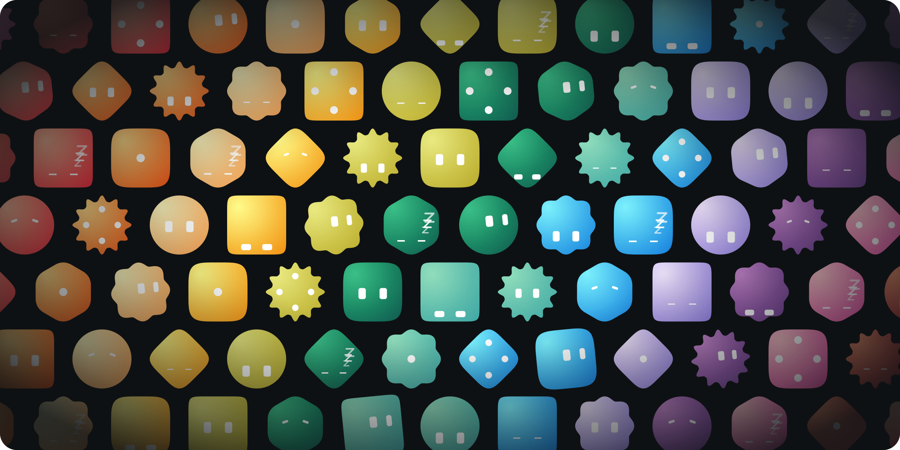

# Moodstone



Animated, procedurally generated avatars for AI agents in React Native. Give an agent a mood and the face reacts. Rendered with [React Native Skia](https://shopify.github.io/react-native-skia/) on the UI thread.

```tsx
import { Moodstone } from "moodstone";

<Moodstone color="pine" mood="thinking" size={48} />;
```

- **Nine moods**, each a seamless loop.
- **Seven cuts** (silhouettes) that morph into each other, with eyes that fit each shape.
- **Twelve palette colours** or any hex, on a surface lit by a slowly orbiting light.
- **UI-thread animation** that leaves the JS thread idle.
- **PNG and SVG exports**, including an animated SVG of the whole loop.

## Install

```bash
npx expo install @shopify/react-native-skia react-native-reanimated react-native-worklets
npm install moodstone
```

Needs React 19+, React Native 0.78+, Skia 2+, Reanimated 4+ and Worklets 0.7+.

## Moods

Every mood works with any cut and colour; the previews mix them.

| Mood         | Cut        | Color       | Preview                                                                             | When the agent is…                      |
| ------------ | ---------- | ----------- | ----------------------------------------------------------------------------------- | --------------------------------------- |
| `idle`       | `circle`   | `pine`      |               | ready, waiting for input                |
| `observing`  | `squircle` | `lemon`     |  | reading context, awaiting a tool result |
| `thinking`   | `hexagon`  | `rose`      |      | searching, making a short tool call     |
| `processing` | `badge`    | `lilac`     |   | reasoning at length                     |
| `working`    | `square`   | `tangerine` |    | streaming output                        |
| `done`       | `burst`    | `sky`       |                 | finished successfully                   |
| `failed`     | `diamond`  | `cherry`    |        | errored                                 |
| `invalid`    | `hexagon`  | `plum`      |        | rejecting the input                     |
| `inactive`   | `squircle` | `mint`      |     | offline or paused                       |

## Props

| Prop            | Type                        | Default        | Notes                                                                  |
| --------------- | --------------------------- | -------------- | ---------------------------------------------------------------------- |
| `mood`          | `Mood`                      | `"idle"`       | Restarts the loop when it changes.                                     |
| `color`         | palette key or hex          | `"pine"`       |                                                                        |
| `cut`           | `Cut`                       | `"circle"`     | Silhouette. Morphs when it changes.                                    |
| `tune`          | `Tune`                      |                | Adjusts the cut, see [Tuning a cut](#tuning-a-cut).                    |
| `shape`         | `Partial<ShapeParams>`      |                | Custom silhouette, like `{ lobes: 12, depth: 0.11 }`. Not with `tune`. |
| `eyeColor`      | `"white" \| "black" \| hex` | `"white"`      |                                                                        |
| `seed`          | `[number, number, number]`  | `DEFAULT_SEED` | Light start angle, drift and orbit. `randomSeed()` makes one.          |
| `size`          | `number`                    | `64`           | In dp.                                                                 |
| `animated`      | `boolean`                   | `true`         | `false` draws one frame, the mood's key pose. Use it for long lists.   |
| `paused`        | `boolean`                   | `false`        | Freezes the loop.                                                      |
| `phase`         | `0..1`                      |                | Loop position of a still, or start offset of a loop.                   |
| `morphDuration` | `number`                    | `460`          | In ms. `0` snaps.                                                      |
| `style`         | `StyleProp<ViewStyle>`      |                | Applied to the canvas.                                                 |
| `ref`           | `Ref<MoodstoneHandle>`      |                | See [Ref handle](#ref-handle).                                         |

### Tuning a cut

`tune` accepts only the parameters the cut exposes, listed in `CUT_TUNES`:

| Cut                             | Tunable                   |
| ------------------------------- | ------------------------- |
| `circle`                        | `n`, `ax`                 |
| `squircle`, `square`, `diamond` | `n`, `rot`, `ax`          |
| `hexagon`                       | `sides`, `round`, `rot`   |
| `badge`, `burst`                | `lobes`, `depth`, `sharp` |

```tsx
<Moodstone cut="hexagon" tune={{ sides: 5 }} />  // ok
<Moodstone cut="circle" tune={{ rot: 30 }} />    // type error: rotating a circle does nothing
```

The type check needs a literal `cut`. For a cut held in state, cast the pair to `CutTune`; keys the cut doesn't expose are ignored at runtime.

### Ref handle

```tsx
const ref = useRef<MoodstoneHandle>(null);
<Moodstone ref={ref} mood="done" />;

const image = ref.current?.snapshot({ size: 1024, background: "#0e1113" }); // SkImage
const base64 = image?.encodeToBase64(); // PNG
ref.current?.restart();
const spec = ref.current?.getSpec(); // AvatarSpec
```

`snapshot` renders offscreen at any size, stills included, and takes a `phase` to capture another moment. `restart` replays the mood from its rest pose. `getSpec` returns the resolved spec for the SVG exports below.

## SVG exports

```ts
import {
  renderAvatarSvg,
  renderAnimatedAvatarSvg,
  stillFrame,
  DEFAULT_SEED,
  PALETTE,
  type AvatarSpec,
} from "moodstone";

const spec: AvatarSpec = {
  seed: DEFAULT_SEED,
  color: PALETTE.pine,
  cut: "circle",
  mood: "thinking",
  eyeColor: "#FFFFFF",
};
const still = renderAvatarSvg(spec, stillFrame(spec), { size: 240 });
const loop = renderAnimatedAvatarSvg(spec, { size: 240, fps: 24 });
```

`stillFrame(spec)` is the mood's key pose; `computeFrame(spec, t)` gives any other moment. The animated SVG uses SMIL and loops seamlessly. No GIF or video encoder is bundled, but `computeFrame` and `renderAvatarImage` give you every frame to encode one.

For a tuned or custom shape, set the spec's `shape` (`tunedShape(cut, tune)` builds a tuned one) and pass the spec through `resolveSpec` so the eyes fit.

### From the command line

A clone of this repo exports SVG files straight from the source, with Node 22.18+ and no build:

```bash
npm run export-svg -- --mood thinking --cut hexagon --color sky
npm run export-svg -- --mood all --animated --out ~/Desktop/moodstone
```

`--help` lists every flag. Without `--out`, files go to `./avatars/`. `npm run avatars` regenerates the previews this README shows, in [`assets/`](assets/).

## Core and Skia layer

`moodstone/core` has no React Native imports. Its pure `computeFrame(spec, t)` describes every frame as plain numbers, and drives both the Skia component and the SVG exports. The main entry re-exports it and adds the Skia pieces the component is built from, for drawing into your own canvas: `useAvatarSpec`, `drawAvatarSkia`, `surfacePath` and `makeSurfaceShader`.

## Example app

`example/` is an Expo app with a one-screen Studio for trying colours, cuts, moods, eyes and tuning. `npm install` at the root sets it up, and it loads the library from `src/`, so edits show up without a build. Deep links set its state, so a script can drive it:

```bash
cd example && npx expo start --ios
xcrun simctl openurl booted "exp://<host>:8081/--/?mood=failed&cut=burst&lobes=9"
```

Parameters: `color`, `cut`, `mood`, `motion` (`animated` or `still`), `eyes`, `theme`, `scroll` (`top` or `end`) and any tunable parameter.

## Development

```bash
npm install     # the library and the example workspace
npm run check   # ESLint, Prettier and tsc
npm run format  # Prettier, then ESLint --fix
npm run build   # bob → lib/
```

## Credits

The single-colour agent face whose personality lives in two eyes comes from Plane's [Agent Avatar Lab](https://agents.plane.so/); the surface, geometry, palette, timing and code here are original. Reading the face as what a persistent agent is doing was inspired by [Designing Grok Bot for a world of persistent agents](https://x.ai/news/designing-grok-bot).

## License

MIT
